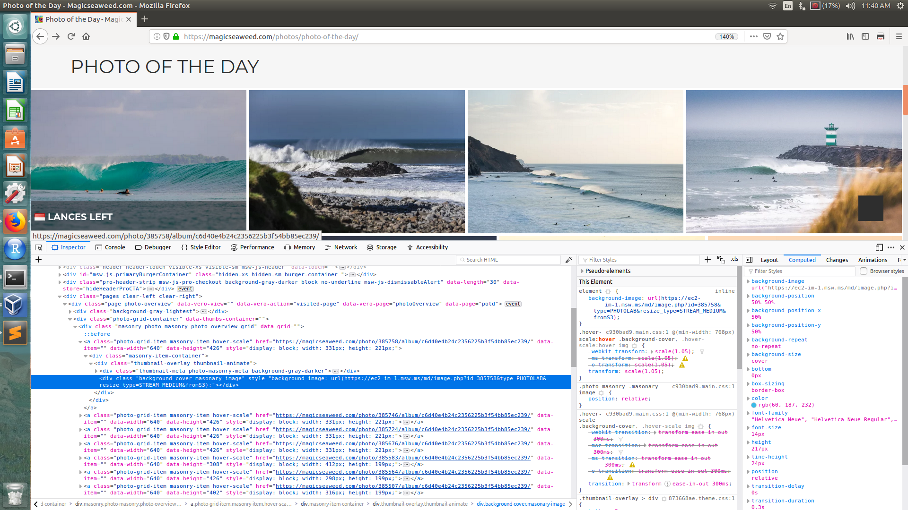
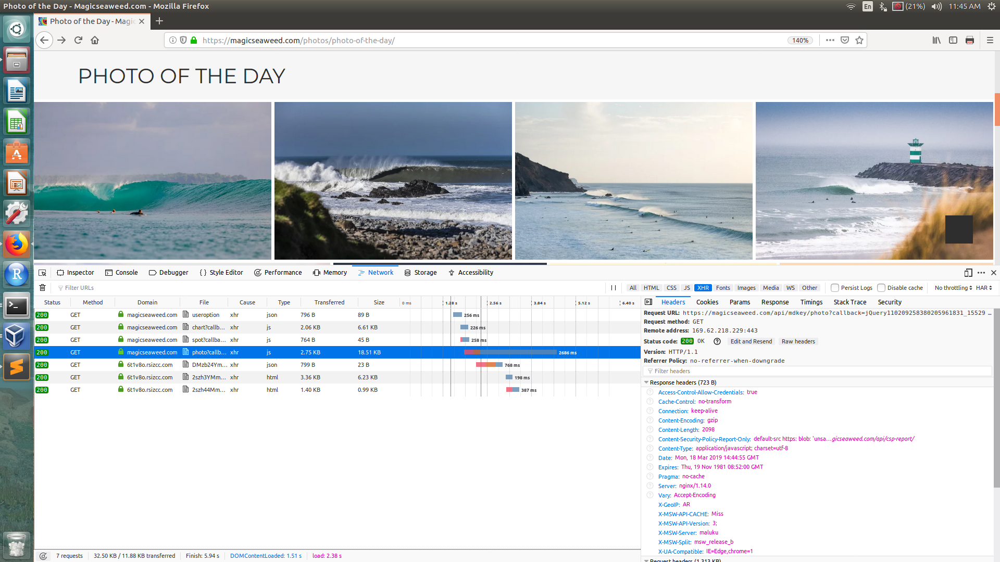
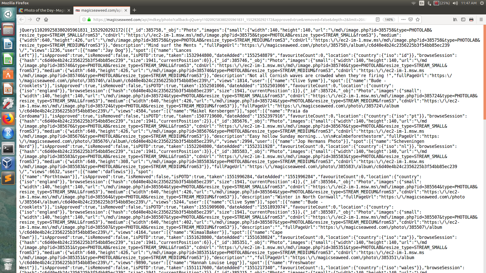
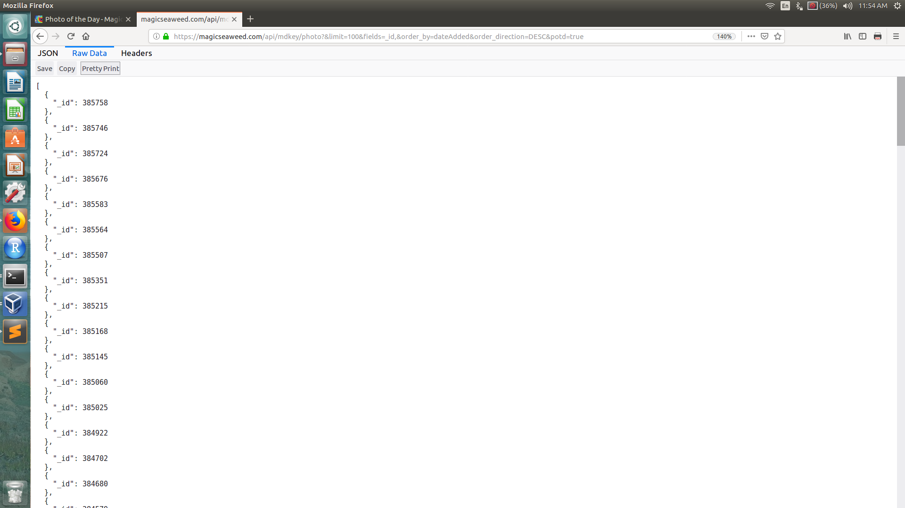

# Automatically update your wallpaper with Magicseaweed's Photo of The Day 


Magicseaweed, my favourite surf forecast site, has a whole archive of epic surf photos. This little python script downloads a photo from Magicseaweed's Photo of The Day archives and sets it as background wallpaper. Built using Python 3 and Ubuntu 16.04. 


## Inspect the Photo of the Day page

First we're going to navigate to [Magicseaweed's photo archive](https://magicseaweed.com/photos/photo-of-the-day/) and use your browser's developer tools to figure out how we can download a photo. 

Righ click on a photo and choose "Inspect Element". The pertinent tag will be highlighted in blue in the element inspector console that opens up. (If you click on the photo you can see it in much higher resolution.)



What interests us is this tag:

```
<div class="background-cover masonary-image" style="background-image: url(https://ec2-im-1.msw.ms/md/image.php?id=385758&amp;type=PHOTOLAB&amp;resize_type=STREAM_MEDIUM&amp;fromS3);"></div>
```

We can see that this is one of many other similar tags, one for each of the rest of the pictures which we can see are uniquely identified by their id.

We could parse the html with BeautifulSoup and extract the ids, but notice that when you scroll to the bottom the page dynamically loads more pictures, this suggests that an easier alternative is to try to intercept the AJAX calls from the page and reproduce/replay them.


## Intercepting AJAX calls

The page initially loads 20 images, but if we scroll down, it executes javascript and asks the server for more images without refreshing the page. 

By using the Network tab in the browser's developer tools we can try to see where our pictures are coming from.

To begin with this tab will be empty. This is because the Network view only starts recording information while it is open. Refresh the page and let's see the new requests that are loaded. 

On the right of the Network tab you can filter by type of resource, a good one to check for any data sources is `XHR`. 

The resource labeled `photo?callback` seems promising so click on this:



If you click on the `photo?callback` request, we can see its details, such as Headers, Parameters and Response, on the frame on the right had side.

In Headers you can see the Request URL which reflects the paramenters you can see in the Params tab:

```
https://magicseaweed.com/api/mdkey/photo?callback=jQuery1102003300840931011728_1552915212212&approved=true&removed=false&depth=2&limit=20&fields=_id,_obj,isApproved,images.small.*,images.medium.*,isRemoved,description,dateAdded,fullPageUrl,views,user.name,spot.name,isPOTD,taken,favouriteCount,location.country.iso,browseSession.hash,browseSession.size,browseSession.currentPosition&order_by=dateAdded&order_direction=DESC&potd=true&_=1552915212213
```

The Response tab shows us a jQuery object. You can see this jQuery object in its entirety if you double click on the `photo?callback` request:




Using [JSONLint validator](https://jsonlint.com/) a we can pretty print the text inside the jQuery parantheses to see that it is valid Json and looks like:

```json
[{
	"_id": 385758,
	"_obj": "Photo",
	"images": {
		"small": {
			"width": 140,
			"height": 140,
			"url": "\/md\/image.php?id=385758&type=PHOTOLAB&resize_type=STREAM_SMALL&fromS3",
			"cdnUrl": "https:\/\/ec2-im-1.msw.ms\/md\/image.php?id=385758&type=PHOTOLAB&resize_type=STREAM_SMALL&fromS3"
		},
		"medium": {
			"width": 640,
			"height": 426,
			"url": "\/md\/image.php?id=385758&type=PHOTOLAB&resize_type=STREAM_MEDIUM&fromS3",
```

After some experimenting in modifying the parameters in the Request URL and seeing what was returned, I simplified the url to one that returns a JSON object directly with just photo IDs: 

```
https://magicseaweed.com/api/mdkey/photo?&limit=100&fields=_id,&order_by=dateAdded&order_direction=DESC&potd=true
```




## Python's urllib module


An easy way to download a resource fom the internet programmatically with Python is the [urllib module](https://docs.python.org/3/howto/urllib2.html). A simple script like the one below allows us to download 100 photo IDs at a time, choose 1 ID at random, and does some minimal error handling. 

```python
#!/usr/bin/env python
import urllib.request
import json

url="https://magicseaweed.com/api/mdkey/photo?&limit=100&fields=_id,&order_by=dateAdded&order_direction=DESC&potd=true"

req = urllib.request.Request(url)
try:
    response = urllib.request.urlopen(req, timeout=10)
except urllib.error.URLError as e:
    if hasattr(e, 'reason'):
        print('We failed to reach a server.')
        print('Reason: ', e.reason)
    elif hasattr(e, 'code'):
        print('The server couldn\'t fulfill the request.')
        print('Error code: ', e.code)
else:
    text = response.read()
    jsn=json.loads(text.decode('utf-8'))
```

With the photo ID in hand, we can query their s3 storage directly and some googling shows that among the s3 options instead of medium you can do `resize_type=STREAM_FULL` to download the picture in the highest resolution.


```python
from random import *

n=randint(1,100)

url = "https://ec2-im-1.msw.ms/md/image.php?id=" + str(jsn[n]['_id']) + "&type=PHOTOLAB&resize_type=STREAM_FULL&fromS3"

urllib.request.urlretrieve(url, "/home/areias/Downloads/POTD.jpeg")
```


## Set picture as background

We can also set the desktop background directly from our python script by using the [os module](https://docs.python.org/2/library/os.html).

```python
import os
os.system("gsettings set org.gnome.desktop.background picture-uri file:///home/areias/Downloads/POTD.jpeg")
os.system("gsettings set org.gnome.desktop.background picture-options zoom")
```

Now we can save our script as POTD.py and run it from from the command line:

```bash
python3 POTD.py
```

## Automate with cron

Finally, we can make this script run on start up by adding the following line to crontab by calling `crontab -e`:

```bash
@reboot /bin/sleep 60 && /usr/bin/python3 /home/areias/Projects/wallpaper/POTD.py > log 2>&1
```

Saving a log allows you to trouble shoot in case something goes wrong.

Running the script 60 seconds after start up makes sure we don't run into [permissions problems or availability of services](https://unix.stackexchange.com/questions/109804/crontabs-reboot-only-works-for-root).

And now you can enjoy a new epic surf picture everytime you start your laptop! This could prove to be dangerous. 


